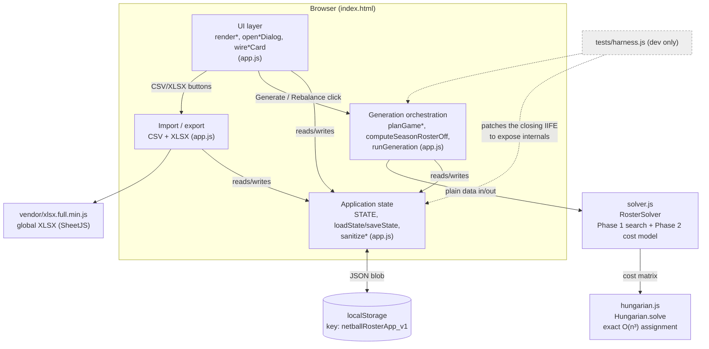

# Architecture Overview

Developer documentation for `nb-roster-mgr` — a season-long netball roster planner. This
folder documents **how the code is built**; for **what "correct" means** (the domain
rules), see [`Netball_Roster_App_Requirements.md`](Netball_Roster_App_Requirements.md)
and [`Netball_Roster_App_Test_Plan.md`](Netball_Roster_App_Test_Plan.md) — most of the
non-obvious behavior in this codebase exists to satisfy a specific numbered requirement
in that spec, and the code comments cite section numbers (`§5.5`, `§8.1`, etc.) back into
it throughout.

## What the app does

A coach enters a squad (each player has an ordered list of preferred positions) and
season parameters (number of games, desired bench size), then generates a full season's
rotation: who plays which of netball's 7 positions each quarter of each game, who's on
the bench, and who's rostered off. Generation is two coupled problems, solved in order:

1. **Season-wide roster-off search** — decide who sits out which whole games, balancing
   even missed-games counts against not stripping a thin position of its only cover.
2. **Per-game position assignment** — for each game's squad (post roster-off, plus any
   fill-ins), solve each quarter as an exact minimum-cost bipartite matching (preference
   rank + playing-time fairness → cost), then locally refine across that game's 4
   quarters.

Everything runs client-side. No build step, no server, no account — `index.html` loads
three plain `<script>` tags and the whole app boots from `DOMContentLoaded`. State lives
in `localStorage`; CSV export/import is the only way to move a season between devices or
coaches.

## Runtime file map

| File | Role | Depends on |
|---|---|---|
| `index.html` | Entry point — loads fonts, `vendor/xlsx.full.min.js`, then the three scripts below in order | — |
| `hungarian.js` | Standalone Kuhn-Munkres (Hungarian) minimum-cost bipartite matching. Pure math, no app knowledge. | nothing |
| `solver.js` | `RosterSolver` — the season-wide roster-off search (Phase 1) and the per-quarter cost model + Hungarian invocation (Phase 2). Pure: takes plain data in, returns plain data out; no DOM, no `localStorage`. | `hungarian.js` (via the shared global `Hungarian`) |
| `app.js` | Everything else: application state (`STATE`), the generation *orchestration* (turning `STATE` into the plain-data inputs `solver.js` expects and writing its outputs back), all UI rendering/event wiring, and CSV/XLSX import-export. One IIFE. | `solver.js`, `hungarian.js` (both attached to `window`) |
| `styles.css` | All styling, theme tokens (`html[data-theme]`) | — |
| `vendor/xlsx.full.min.js` | Vendored SheetJS build (not a CDN dependency) — exposes global `XLSX`, used only by `exportXlsx()` | — |

`hungarian.js` and `solver.js` are loaded as classic scripts and attach themselves to
`window` (`root.Hungarian` / `root.RosterSolver`) *and* export via `module.exports` when
present — the same files run unmodified in the browser and under Node in `tests/`.

## Component relationships

`app.js` is not internally split into separate files — the four boxes above are a
functional grouping of one 2,200-line IIFE, not separate modules with real import
boundaries. See [`docs/modules/`](modules/) for a per-area breakdown of that same file.

## Module docs

| File | Covers |
|---|---|
| [`modules/state-and-storage.md`](modules/state-and-storage.md) | `STATE` shape, `defaultState`/`newGameState`, `loadState`/`saveState`, input sanitization |
| [`modules/engine.md`](modules/engine.md) | The orchestration layer: turning `STATE` into solver input and writing results back (`planGameAvailability`, `planGameSquad`, `computeSeasonRosterOff`, `runGeneration`, report aggregations) |
| [`modules/solver.md`](modules/solver.md) | `solver.js` — Phase 1 season-wide search, Phase 2a/2b cost model and refinement |
| [`modules/hungarian.md`](modules/hungarian.md) | `hungarian.js` — the assignment algorithm itself |
| [`modules/ui-shell-and-modals.md`](modules/ui-shell-and-modals.md) | Tab shell, the shared modal/toast/validation kernel every dialog is built on |
| [`modules/ui-setup-and-fillins.md`](modules/ui-setup-and-fillins.md) | Setup tab (season params, player roster) and Fill-ins tab |
| [`modules/ui-schedule.md`](modules/ui-schedule.md) | Schedule tab — game cards, rotation grid, roster-off/fill-in/slot-edit dialogs (the biggest and trickiest UI surface) |
| [`modules/ui-reports-and-settings.md`](modules/ui-reports-and-settings.md) | Reports tab, Settings tab |
| [`modules/csv-xlsx-io.md`](modules/csv-xlsx-io.md) | CSV parse/export/import round-trip, XLSX report export |

## Other docs in this folder

- [`data-model.md`](data-model.md) — entity-relationship diagram of `STATE`
- [`flows.md`](flows.md) — sequence diagrams for season generation and the trickier manual-edit flows
- [`gotchas.md`](gotchas.md) — global state, persistence, and non-obvious design decisions a new contributor needs to know
- [`Netball_Roster_App_Requirements.md`](Netball_Roster_App_Requirements.md) — domain/requirements spec (pre-existing)
- [`Netball_Roster_App_Test_Plan.md`](Netball_Roster_App_Test_Plan.md) — test plan (pre-existing)
- [`Codebase_Review_Handoff.md`](Codebase_Review_Handoff.md) — a point-in-time review handoff, not a living doc

## Testing

- `npm test` → `tests/run.js`, 59 unit tests against the engine, loaded via
  `tests/harness.js` — a Node `vm` sandbox that reads `app.js`'s source text, appends a
  `module.exports` block just before the closing `})();`, and runs it with stubbed
  `document`/`localStorage`/`Blob`/`URL`. This is how engine-level functions that are
  never otherwise exported get tested without a real DOM.
- `npm run test:ui` → `tests/ui-smoke.js`, a headless Playwright walk through the real
  rendered UI (serves the repo statically, drives it with Chromium) — the golden path a
  coach would actually click through, plus a handful of dialog-cancel/edge-case checks.
  Requires `npx playwright install chromium` once.
