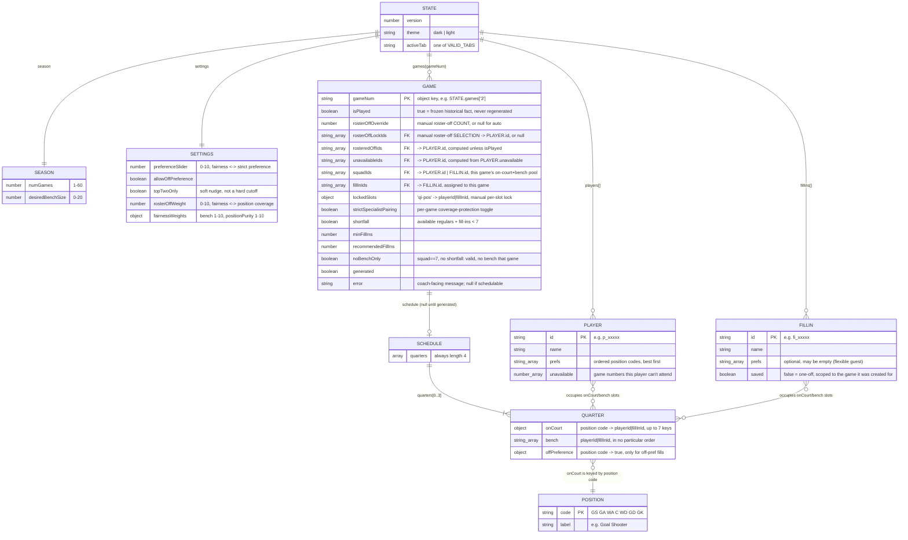

# Data Model

Everything lives in one JSON-serializable object, `STATE` (see
[`modules/state-and-storage.md`](modules/state-and-storage.md)). This diagram shows its
shape as entities and relationships — it's a description of nested plain-JS-object
structure, not a real database schema (there's no DB; this *is* the `localStorage` blob).

## Notes on the relationships

- **`GAME` is keyed by game number, not id.** `STATE.games` is an object
  `{ "1": GameState, "2": GameState, ... }`, not an array — `getGame(num)` does
  lazy-create-on-read (`STATE.games[key] = STATE.games[key] || newGameState()`).
  `ensureGamesExist()` also *prunes* any game number beyond the current
  `season.numGames` after the season length is shortened.
- **`onCourt` has at most 7 keys**, one per `POSITION` — never more, sometimes fewer (an
  unfilled slot from a manual edit, or entirely absent before generation).
- **`bench.length` is not fixed** — it's `squad.length - 7` for that specific game (squad
  size varies with roster-off/unavailability/fill-ins), and can be `0` (`noBenchOnly`).
- **A player never appears twice across `onCourt` + `bench` in the same quarter.** This
  invariant is maintained by construction in every write path (`solveQuarterPositions`,
  `refineGameQuarters`, and the manual-edit dialogs in `ui-schedule.md`) — CSV import is
  the one place it's re-checked defensively (`sanitizeImportedState`), since an
  externally-edited file could violate it.
- **`PLAYER` and `FILLIN` share an id-space concept but not a table.** A quarter's
  `onCourt`/`bench` ids can be either a `PLAYER.id` or a `FILLIN.id` — resolving one
  always means `byId(STATE.players,id) || byId(STATE.fillIns,id)`. Fill-ins are excluded
  from every season-fairness computation (missed-games counts, cumulative on-court/bench
  totals) even though they occupy real slots.
- **A `FILLIN` with `saved:false`** is a genuine one-off: still stored in
  `STATE.fillIns` (so its `id` resolves normally), but filtered out of the "assign a
  fill-in" candidate list for any game other than the one it was created for.
- **`SCHEDULE.quarters` is always exactly length 4** — hardcoded throughout the engine
  (`for(let q=0;q<4;q++)` in `runGeneration`), not derived from any setting.
