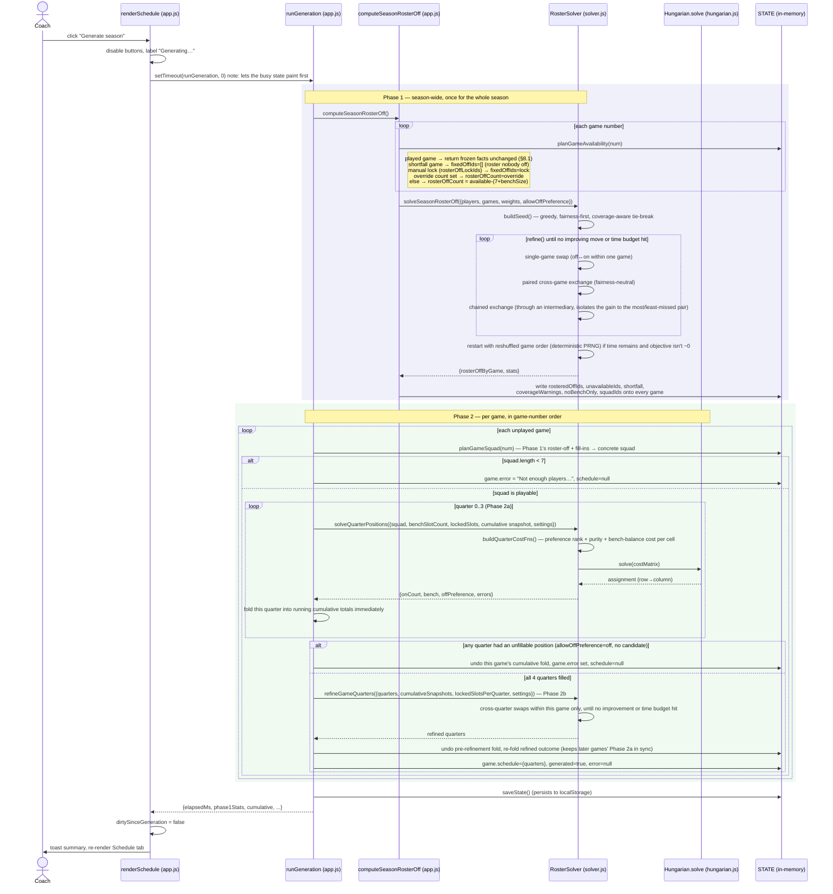
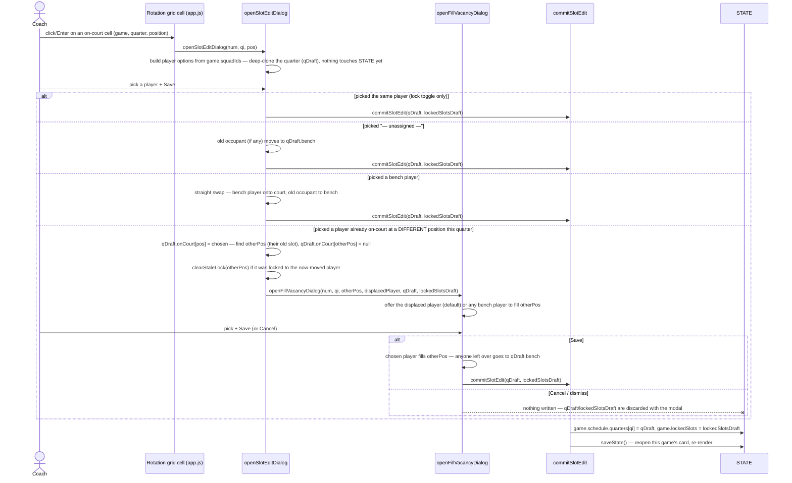
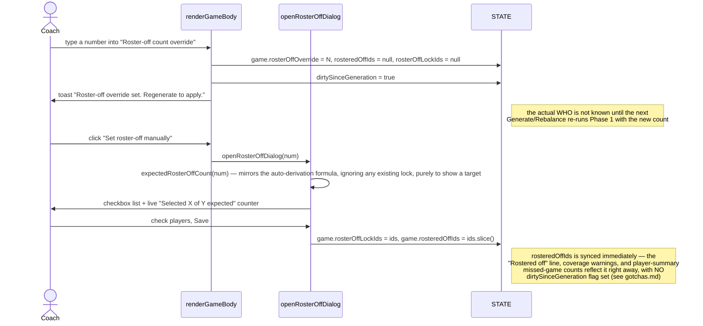
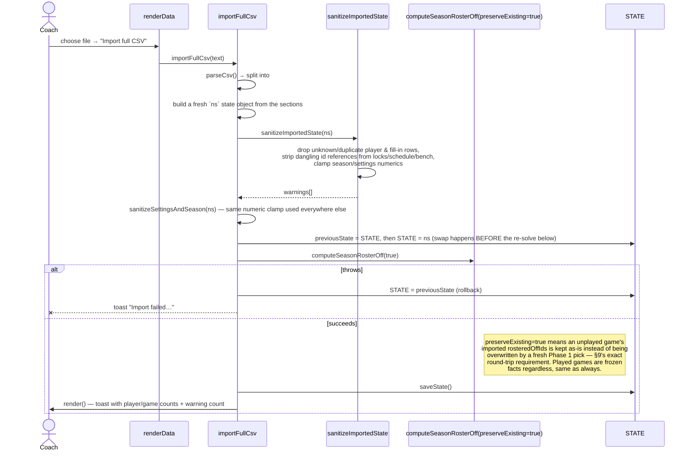

# Key Flows

Sequence diagrams for the flows most likely to trip up a new contributor — full season
generation (where availability, roster-off, and position assignment all interact), the
manual slot-edit cascade, the manual roster-off override, and CSV import. Function names
match `app.js`/`solver.js`/`hungarian.js` exactly; see [`modules/`](modules/) for what
each one does in isolation.

## 1. Season generation ("Generate season" / "Rebalance remaining games")

The flow that ties everything together: Phase 1 decides *who* sits out each whole game
(season-wide), then Phase 2 decides, per game, *which position* everyone plays each
quarter — Phase 2's input (`planGameSquad`) depends on Phase 1's output, so Phase 1 must
finish completely, for every game, before Phase 2 starts on any game.

A played game (`isPlayed`) is skipped by Phase 2 entirely and only contributes its
already-frozen schedule to the running `cumulative` totals — its `rosteredOffIds`,
`unavailableIds`, and `schedule` are never touched by generation, no matter what else
changes (see [`gotchas.md`](gotchas.md)).

## 2. Manual slot edit — the swap cascade

Clicking an on-court cell opens `openSlotEditDialog`. What happens next depends on what
the coach picks — three branches commit immediately, one cascades into a second dialog.
This is the trickiest interaction in the UI layer because moving one player can vacate a
*different* slot that also needs a decision.

**Why the draft/commit split matters:** every branch above builds `qDraft` and
`lockedSlotsDraft` as copies and only `commitSlotEdit` ever writes to live `STATE`. A
Cancel, a backdrop click, or Escape at *any* point — including abandoning the follow-up
vacancy dialog — leaves the schedule byte-for-byte unchanged, because nothing was mutated
in place to begin with. (This replaced an earlier version that mutated `STATE` directly
before opening the follow-up dialog, which had no Cancel button — dismissing it left a
real gap in the quarter with the partial state already persisted. See the comment above
`openSlotEditDialog` in `app.js`.)

## 3. Manual roster-off override

Two different ways to override roster-off for one game, with two different consistency
guarantees:

The override-*count* path and the manual-*selection* path leave `STATE` in different
states of freshness — see [`gotchas.md`](gotchas.md#roster-off-dirty-flag-asymmetry).

## 4. Full CSV import (Data tab)

